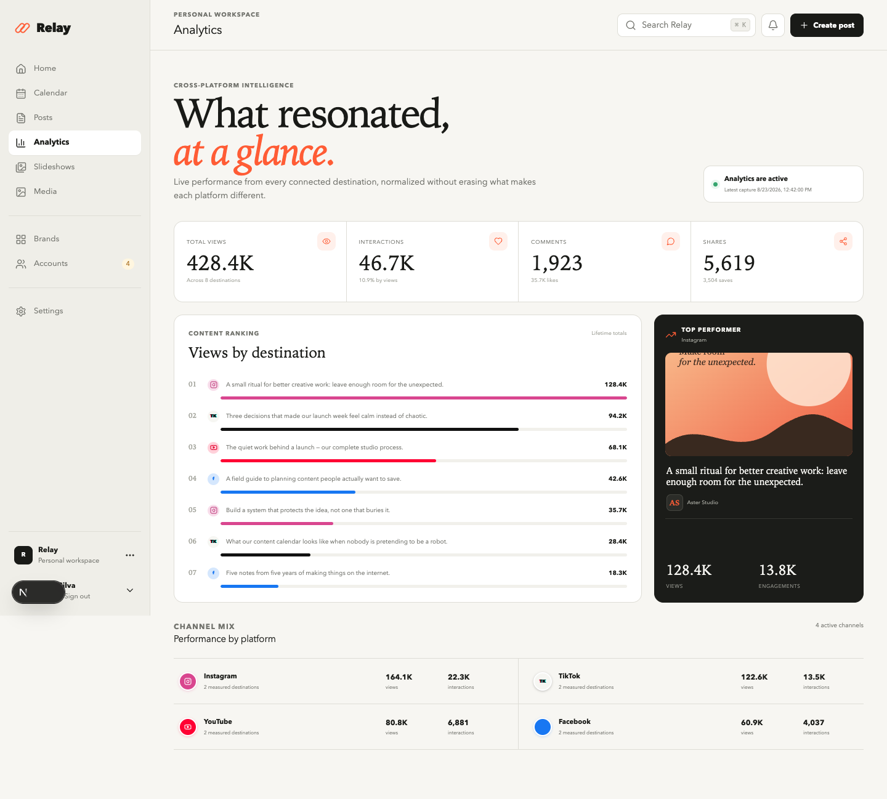
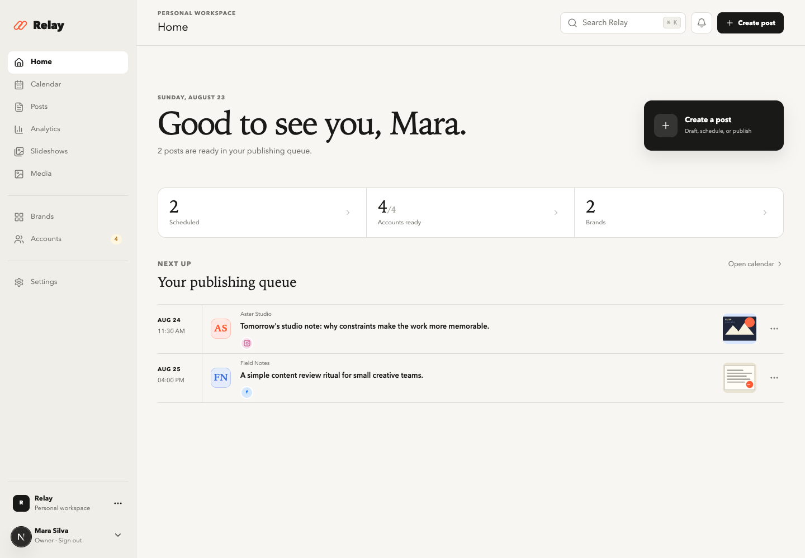
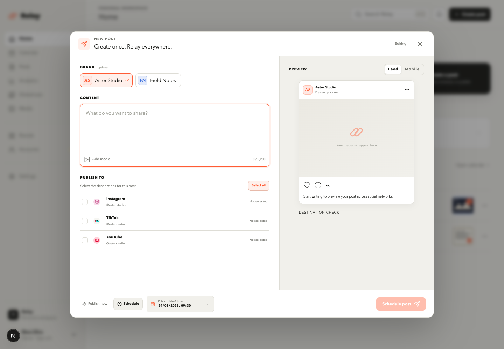

# Relay

**The open-source social publishing workspace for people and agents.**

Plan once, publish across Instagram, Facebook, TikTok, and YouTube, then see what resonated without hopping between dashboards.



## What Relay does

- Composes, schedules, and publishes one post or a whole campaign.
- Builds reusable 9:16 photo slideshows from R2 images, with optional per-slide text, bulk title generation, ordered JPEG rendering, and multi-platform publishing through the shared composer.
- Connects Instagram, Facebook Pages, TikTok, and YouTube through OAuth.
- Tracks views, likes, comments, shares, saves, reach, and watch metrics when the platform exposes them.
- Gives AI agents a scoped REST API with idempotent bulk operations.
- Stores media in Cloudflare R2 and provider credentials encrypted in PostgreSQL.
- Runs publishing, token refresh, and analytics collection in a durable background worker.

<table>
  <tr>
    <td width="50%"></td>
    <td width="50%"></td>
  </tr>
</table>

## Quick start

Relay ships as a Docker Compose stack with the web app, worker, migrations, and PostgreSQL.

```bash
git clone https://github.com/lapreamarcelo/relay.git
cd relay
cp .env.example .env
docker compose up -d --build
```

Before starting, set the generated secrets and Cloudflare R2 credentials in `.env`. Then open [http://localhost:3000/register](http://localhost:3000/register), enter `RELAY_SETUP_TOKEN`, and create the owner account.

Generate the application secrets with:

```bash
openssl rand -hex 32      # POSTGRES_PASSWORD, BETTER_AUTH_SECRET, RELAY_SETUP_TOKEN
openssl rand -base64 32   # ENCRYPTION_KEY — keep this stable
```

The minimum configuration is documented in [`.env.example`](.env.example). Add provider app credentials only for the networks you want to connect.

For the complete walkthrough, see [Self-host Relay](docs/SELF_HOSTING.md), which covers local Docker installation, Cloudflare R2, production deployment with Coolify, health checks, upgrades, and backups. Then use [Social app setup](docs/SOCIAL_APP_SETUP.md) to create the Facebook, Instagram, TikTok, and YouTube applications and obtain their API credentials.

## OAuth callback URLs

Register the callback for every connection method you enable. Replace `<APP_URL>` with the browser-visible origin configured in `.env` (for example, `https://relay.example.com`) and do not add a trailing slash.

| Platform / connection method | Callback URL |
| --- | --- |
| Facebook Pages | `<APP_URL>/api/oauth/facebook/callback` |
| Instagram via Facebook Login | `<APP_URL>/api/oauth/instagram/callback` |
| Instagram Login | `<APP_URL>/api/oauth/instagram-standalone/callback` |
| TikTok | `<APP_URL>/api/oauth/tiktok/callback` |
| YouTube | `<APP_URL>/api/oauth/youtube/callback` |

For local development with the default configuration, the YouTube callback is `http://localhost:3000/api/oauth/youtube/callback`. If you change `RELAY_PORT` or `APP_URL`, update every callback registered with the providers to match.

## External slideshow image sources

Set a default Pexels key in `.env`, then restart Relay:

```dotenv
PEXELS_API_KEY=your_pexels_api_key
```

Create the key from the [Pexels API dashboard](https://www.pexels.com/api/). Relay uses this server-side key for slideshow searches and never sends it to the browser. A user can optionally provide a personal key in the Relay interface to override the server default:

1. Open **Slideshows**, open or create a slideshow, and select **Add images**.
2. Select the **Pexels** tab.
3. Optionally paste a personal key into **Personal API key**.
4. Enter a search and select **Search**, then add the photos you want.

Relay preserves the photographer, attribution, and Pexels source-page metadata for imported photos.

Personal override keys are submitted only to the self-hosted Relay instance when a search is performed. They are never written to slideshow projects, R2 objects, application logs, or exported media. The optional **Remember this override in this browser only** setting uses that browser's local storage; it is off by default. Selected images are downloaded by the self-hosted server into the user's temporary R2 staging area, validated as images, limited to 20 MB, and committed to Media only when the slideshow is saved or rendered.

Relay uses only the official Pexels API.

## Publishing and analytics

| Platform | Publishing | Analytics collected |
| --- | --- | --- |
| Instagram | Feed, Reel, Story | Views, reach, likes, comments, shares, saves, watch time |
| Facebook Pages | Feed, Reel | Views when available, reactions, comments, shares |
| TikTok | Video with creator-aware privacy controls | Views, likes, comments, shares |
| YouTube | Resumable video upload | Views, likes, comments |

Metrics are saved as timestamped snapshots, so Relay can show both the latest totals and historical changes. The worker checks new posts frequently, then reduces polling as posts age.

Provider permissions and review rules still apply. After upgrading an existing Relay installation, reconnect social accounts so the new analytics scopes are granted.

## Relay CLI

The first-party CLI is the recommended interface for agents, scripts, and CI. It exposes accounts, posts, campaigns, templates, brands, R2 media and folders, slideshow/video editors, bulk workflows, analytics, and publishing defaults as JSON commands.

### Install

Relay requires Node.js 22 and pnpm 11. From a cloned Relay repository, install the workspace and run the CLI locally:

```bash
corepack enable
pnpm install
pnpm relay -- --help
```

To make `relay` available outside the repository, install the workspace CLI from the repository root:

```bash
npm install --global ./apps/cli
relay --help
```

The global install is local—it installs the checked-out `apps/cli` package and does not download or publish a separate npm package.

### Configure

In Relay, open **Settings → API keys**, create a key, and copy it when it is shown. Configure the Relay origin and key in the shell that will run the CLI:

```bash
export RELAY_URL="https://relay.example.com"
export RELAY_API_KEY="relay_sk_..."
```

Keep the key out of prompts, command arguments, source files, and committed `.env` files. Confirm the connection with read-only commands before mutating content:

```bash
relay health check
relay accounts list
relay folders list
```

When using the repository-local command, replace `relay` with `pnpm relay --`.

### Use with agents

Relay ships a Codex-compatible skill at [`.agents/skills/relay-cli/SKILL.md`](.agents/skills/relay-cli/SKILL.md). Its optional creative and analytics workflow reference is in [`.agents/skills/relay-cli/references/workflows.md`](.agents/skills/relay-cli/references/workflows.md).

Codex discovers the repository copy while working inside this checkout. Ask for it explicitly with `$relay-cli`, for example:

```text
$relay-cli list my connected destinations and media folders.
$relay-cli create a draft from the rendered video in folder <id>; do not publish it.
```

To make the skill available from other repositories, copy the complete `relay-cli` folder into `$CODEX_HOME/skills/relay-cli` (normally `~/.codex/skills/relay-cli`). Keep `SKILL.md` and its `references` directory together.

See the complete [CLI guide](docs/CLI.md) for every command and the [Agent API guide](docs/AGENT_API.md) for request bodies. MCP remains available only as an optional compatibility adapter.

## Agent API

Create a scoped key under **Settings → API keys**, then let an agent discover accounts and media, build or bulk-generate videos and slideshows, schedule up to 100 posts at once, reschedule, publish immediately, delete, or retrieve analytics history. The CLI uses these same REST endpoints, which can also be called from a shell with `curl` or any HTTP client.

```bash
curl "$RELAY_URL/api/v1/analytics?postId=$POST_ID" \
  -H "Authorization: Bearer $RELAY_API_KEY"
```

Every automated create request supports a stable `clientRequestId`, making retries safe. See the complete [Agent API guide](docs/AGENT_API.md).

Relay also includes a runnable stdio MCP adapter for clients that specifically require MCP, while keeping authorization and scheduling logic in the REST API.

## Architecture

```text
Browser / Agent
      │
      ▼
Next.js web + REST API ───── Cloudflare R2
      │
      ▼
PostgreSQL ◀──────── Publishing & analytics worker
                         │
                         ▼
              Social platform APIs
```

This is a pnpm monorepo:

- `apps/web` — Next.js dashboard and API
- `apps/cli` — first-party JSON CLI for agents and automation
- `apps/worker` — publishing, credential refresh, and analytics jobs
- `packages/core` — shared domain types
- `packages/database` — PostgreSQL schema and migrations
- `packages/providers` — OAuth, publishing, and analytics adapters

For local development:

```bash
pnpm install
pnpm db:migrate
pnpm dev
```

## Deployment notes

- Production deployments can use `compose.coolify.yaml`; migrations run automatically.
- Follow the complete [Coolify deployment guide](docs/SELF_HOSTING.md#production-deployment-with-coolify) for service domains, required variables, owner setup, and verification.
- `APP_URL` must exactly match each provider's registered OAuth callback origin.
- `R2_PUBLIC_URL` must be HTTPS and reachable by the social platforms.
- `R2_RESOLVED_IP` is an optional emergency override for a failing DNS-selected R2 edge; leave it empty normally and only use a trusted Cloudflare IP.
- Keep `ENCRYPTION_KEY` unchanged or existing connected-account tokens cannot be decrypted.
- Close public signup with `ALLOW_REGISTRATION=false` after creating the owner.

## Contributing

Issues and pull requests are welcome. If you add a provider, keep its OAuth, publishing, analytics normalization, and tests together in `packages/providers`.

Relay is under active development. Public posting and analytics availability depend on the permissions approved for your provider applications.
